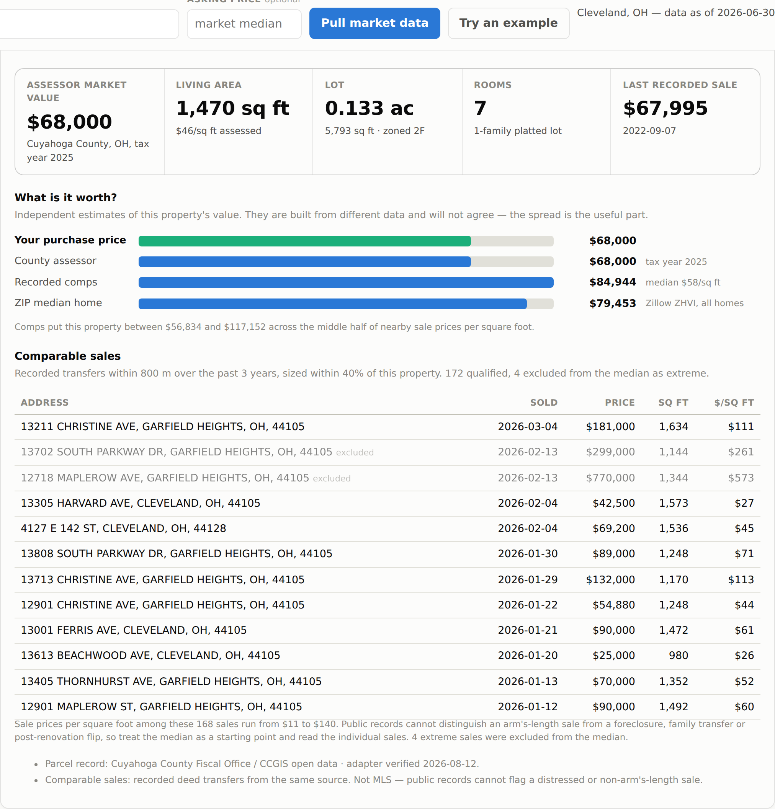

# Property Investment Analyzer

Underwrite a US residential rental property in seconds. Enter the property's
address and the app pulls live home values, market rents, neighborhood price
trends and today's mortgage rate from public data sources, pre-fills a complete
deal, and tells you whether the numbers work — with the reasoning shown, not
just a score.

Built for the investor deciding whether to pursue a specific property.


The county's record of the same property, with recorded sold comps and three
independent value estimates:



And its market fundamentals — where the story gets more complicated:


## Quick start

```bash
pip install -r requirements.txt
uvicorn app.main:app --reload
```

Open http://127.0.0.1:8000, type the property's address, and click **Pull market
data**. A bare 5-digit ZIP works too. The first lookup downloads the underlying
research files and caches them under `data/cache/`; later lookups are instant.

## What it does

**Resolves the exact property.** An address goes through the Census Geocoder,
which returns a normalized address, coordinates, ZIP, county and census tract —
free and without a key. The app shows you what it matched so you can confirm it
found the right property before trusting the numbers.

**Pulls the market context for you.** Typical home value and rent, how both have
grown over 1, 5 and 10 years, the local price-to-rent ratio, the state's average
effective property tax rate, and this week's 30-year fixed mortgage rate. Every
one of these becomes an editable input, never a hidden constant.

**Uses the finest geography available.** Giving an address rather than a ZIP buys
census-tract resolution on price trends via the FHFA tract-level index — that is
neighborhood scale, not city scale, and it can differ sharply from the ZIP
median. FHFA suppresses tracts with too few recorded transactions (roughly a
third of them), and those fall back to the ZIP series with the substitution
stated.

**Reads the county's own record of the property.** Where a county adapter is
configured, the app pulls the assessor's parcel record — market value, living
area, lot size, land use, zoning, and the last recorded sale — and uses the
assessor's value as the purchase-price default instead of a ZIP median. It then
assembles **comparable sales** from recorded deed transfers nearby, sized within
40% of the subject, and triangulates three independent value estimates: the
assessor's, the comps', and the ZIP median. They will not agree, and the spread
is the point.

**Separates living area from total area.** A parcel usually carries more than
one structure — the dwelling plus a garage or shed — so the app reports the
dwelling, the detached outbuildings and the total under roof as three
different numbers, and prices per square foot off the dwelling alone. It also
says what the figure is *not*: these are building footprints, so an attached
garage sits inside the measurement and a converted garage adds living space
without changing it. Verify against the listing before pricing per foot.

**Models how the deal is capitalised.** Rehab is either capital you put in or
debt you take on, so the rehab budget carries a financed percentage: financing
it lowers cash in, raises the payment and cuts DSCR, and the app shows all
three moving. An interest-only period is available too, and reports what it
costs — the payment step-up when it ends, and the equity you did not build.

**Runs a real pro forma.** A year-one operating statement from gross scheduled
rent down to cash flow, with vacancy, maintenance, CapEx reserves, management,
taxes, insurance and debt service each broken out. Reserves are included by
default because leaving them out is the most common way an amateur analysis
turns a losing property into a winning-looking one.

**Reports the metrics lenders and investors actually use.** Cap rate,
cash-on-cash return, DSCR, gross rent multiplier, rent-to-price ratio, operating
expense ratio, break-even occupancy, IRR over the hold, and equity multiple.

**Projects the hold.** Property value, loan amortization, equity, NOI and
cumulative cash flow year by year, then a sale at the end net of selling costs —
with a table view alongside the chart.

**Stress-tests the deal.** A grid of monthly cash flow across five interest rates
and five rent outcomes, so you can see how much has to go wrong before the
property stops paying for itself.

**Gives a verdict with reasons.** A 0–100 score weighing cash-on-cash return
(35%), DSCR (25%), the spread between cap rate and borrowing rate (20%) and
rent-to-price (20%) — followed by plain-language findings like "Cap rate is 1.2
pts below the borrowing rate (negative leverage)." The reasons matter more than
the score; they tell you *why*.

## Market fundamentals

Underwriting tells you whether the numbers work today. It cannot tell you
whether the market will still support the rent in year five. A second panel
answers that from county and ZIP data, scored 0–100 and explained in English:

- **Jobs** — employment growth and the unemployment rate against the national rate
- **People** — county population growth and *measured* net domestic migration
- **Listings** — days on market, inventory direction, share of listings cutting
  price, and the pending-to-active ratio, at ZIP resolution
- **Prices and incomes** — the FHFA transaction-based index and per-capita income
- **Supply** — new housing units permitted, the pipeline that competes with you
- **Rent reality check** — your rent assumption against two independent
  benchmarks: Zillow ZORI and HUD Small Area Fair Market Rents by bedroom count

The two verdicts are deliberately separate, because they disagree in useful
ways. Cleveland ZIP 44105 scores a strong deal on cash flow and only *Mixed* on
fundamentals — the rent covers the mortgage comfortably, but the county is
losing both jobs and people. That tension is the actual decision.

## Data sources

All public. **No API keys required for anything.**

| Data | Source | Via | Cadence |
|---|---|---|---|
| Address → ZIP, county, census tract | [Census Geocoder](https://geocoding.geo.census.gov/) | Direct API | Live |
| Parcel records & sold comps | County assessors | Per-county ArcGIS | Varies |
| Neighborhood price index | FHFA HPI, census tract | Direct CSV | Annual |
| Mortgage rates (30/15-yr fixed) | Freddie Mac PMMS | [FRED](https://fred.stlouisfed.org/series/MORTGAGE30US) | Weekly |
| Typical home value (ZHVI) | [Zillow Research](https://www.zillow.com/research/data/) | Direct CSV | Monthly |
| Typical rent (ZORI) | Zillow Research | Direct CSV | Monthly |
| Listing metrics by ZIP | [Realtor.com Research](https://www.realtor.com/research/data/) | Direct CSV | Monthly |
| Listing metrics by county (history) | Realtor.com | FRED | Monthly |
| Employment & unemployment | BLS Local Area Unemployment Statistics | FRED | Monthly |
| House price index | FHFA all-transactions | FRED | Annual |
| Per-capita income | BEA regional accounts | FRED | Annual |
| Building permits | Census Building Permits Survey | FRED | Annual |
| Population & net domestic migration | Census Population Estimates Program | Direct CSV | Annual |
| Fair market rents by ZIP and bedroom | HUD Small Area FMRs | Direct XLSX | Annual |
| ZIP → county mapping | Census ZCTA relationship file | Direct TXT | Decennial |
| Migration direction by state | U-Haul Growth Index | Bundled snapshot | Annual |
| Property tax rates by state | Census ACS-derived | Bundled table | Static |
| Adopted tax rates by taxing unit | Texas Comptroller | Bundled table | Annual |
| Insurance premiums & claims by ZIP | Treasury FIO / NAIC | Bundled table | 2018-2022 |

`GET /api/sources` returns this same inventory at runtime with each cadence, so
the freshness of an analysis is auditable rather than implied.

### How "instant" actually works

Every source above is fetched on demand and returns its newest published
vintage immediately — but an API cannot make a monthly series daily. What you
actually get today:

- **Mortgage rates** are a weekly survey (published Thursdays). Daily rate
  pricing is commercial-only.
- **Listing metrics** are the freshest signal available, roughly two weeks
  after month end.
- **Zillow values and rents** run about three weeks behind month end.
- **Employment** runs about three weeks behind.
- **Population, migration, incomes, permits and FMRs** are annual.

Cache lifetimes are matched to those cadences (12 hours for weekly series, 24
for monthly, a week for annual, 90 days for geographic crosswalks), so the app
never re-downloads a monthly file hourly to no purpose.

**A note on FRED.** Reading BLS, Census, BEA, FHFA and Realtor.com through
FRED's CSV endpoint is what keeps this app key-free. Both the BLS and Census
APIs now require free registration keys — the Census data API returns a 302 to
`missing_key.html` for every unauthenticated request, and the BLS v2 public pool
is routinely exhausted. FRED mirrors the series that matter and asks for
nothing. County series are addressed by FIPS code, so they resolve for any ZIP
in the country; rural counties are missing some series and every fetch degrades
to "unavailable" rather than failing the request.

Downloads are cached on disk. If a source is unreachable the app serves the
stale cache rather than failing; if there is no cache at all, the API returns a
clear error and the deal inputs still work by hand.

## Property tax, done properly

Property tax is the largest operating expense a landlord carries, and a
statewide average is a poor way to estimate it. The app takes the best source
available, in order:

1. **The amount the county actually billed** on the parcel, where the assessor
   publishes it. Cuyahoga does: 2.34% of market value on the example property,
   against Ohio's 1.53% statewide average.
2. **The sum of the jurisdictions that tax the parcel** — county, city, school
   district and special districts — from each unit's adopted rate.
3. **The statewide average**, with the app saying that is what it used.

Lubbock County is configured at jurisdiction level from the [Texas Comptroller's
2025 Statewide Report of Tax Rates](https://comptroller.texas.gov/taxes/property-tax/docs/2025-total-rates-levies.xlsx),
with the school district resolved by a spatial lookup against the City of
Lubbock's district boundaries. The spread that makes this worth doing:

| School district | Total rate in the City of Lubbock | Tax on a $131,890 house |
|---|---|---|
| Lorenzo | 1.5844% | $2,090 |
| **Lubbock** | **1.7694%** | **$2,334** |
| Idalou | 1.9001% | $2,506 |
| Abernathy | 2.0027% | $2,641 |
| Frenship | 2.0589% | $2,715 |
| Lubbock-Cooper | 2.0691% | $2,729 |
| Roosevelt | 2.1154% | $2,790 |
| New Deal | 2.1281% | $2,807 |
| Shallowater / Slaton | 2.1574% | $2,845 |

A 36% spread inside one county, against a Texas statewide average of 1.68% that
understates most of it. Every rate is itemised in the UI with its comptroller
unit ID, so an investor can audit the number rather than trust it.

Public improvement districts are excluded — they apply only to parcels inside
specific developments and membership cannot be read from the parcel record.
Where one applies it is additive, and the app says so.

### The Texas homestead trap

Texas caps the taxable value of a homesteaded property at 10% growth a year and
grants exemptions that reduce it further. **A buyer inherits none of it.** The
exemptions come off, the cap resets, and the first bill is assessed on full
market value. On a long-held property the seller's tax bill can be far below
what a new owner will pay, which makes it a dangerous thing to underwrite from.

**50,404 of the 83,041** single-family parcels in the Lubbock layer carry an
exemption, so this is the common case, not the exception. Where the county
publishes the flag the app shows a warning naming the exemptions held, and it
always assesses tax on your purchase price rather than the seller's basis.

### Insurance, priced by ZIP

A flat national insurance default is wrong almost everywhere, and wrong in both
directions. The app uses the ZIP's own figure from the [Treasury/NAIC homeowners
data call](https://home.treasury.gov/news/press-releases/jy2791) — ZIP-level
premiums, claim frequency, severity, loss ratios and non-renewal rates collected
from insurers covering an annual average of 49.3 million policies.

| ZIP | Premium | vs national median |
|---|---|---|
| Lubbock 79412 | $2,412 | 1.56x |
| Lubbock 79423 | $2,406 | 1.55x |
| Cleveland 44105 | $1,359 | 0.88x |
| Lakewood 44107 | $1,265 | 0.82x |

The old $1,500 default understated Lubbock by 61% and overstated Lakewood. West
Texas ZIPs run a median of $2,421 against $1,551 nationally.

The claims history matters as much as the premium. Lubbock 79423 saw **47% of
policies file a claim** in its worst year, with insurers paying out 3.3x premium
— that is hail, and it is what precedes rate rises and tightened underwriting.
The app surfaces those years rather than burying them in an average.

Two caveats the app states on the page: the data runs to **2022**, the most
recent year published, and the hard market since has moved premiums — treat it
as a floor and get a quote. And it is the average *owner-occupied* premium; a
landlord policy on the same house is written differently and usually costs more.

## County parcel adapters

Assessor data is the one part of this app that cannot be national. Every county
publishes its own service with its own schema, so support is added a county at a
time in `data/county_parcels.json` — a service URL, a coordinate system, and a
field mapping. Cuyahoga County, OH ships configured and verified.

To add a county, call `GET /api/parcel?address=...` for an address in it. With no
adapter configured, the response searches the ArcGIS Online catalogue and returns
candidate parcel layers for that county, which is the starting point for a
mapping. `GET /api/parcel-sources` lists what is configured.

Three things this layer gets right that a naive implementation does not:

- **The geocoder's point is not inside the parcel.** Census returns a coordinate
  interpolated along a TIGER street centerline, which lands in the roadway.
  Point-in-polygon finds nothing; the app searches a small radius and picks the
  parcel whose address actually matches, widening only if it must.
- **Services often refuse to reproject.** The layer may be Web Mercator while
  advertising WGS84 in its name. The app converts coordinates into the layer's
  own system rather than trusting the service to do it.
- **Assessed is not market.** Ohio publishes appraised market value; other states
  publish a fixed fraction of it. The config carries a `value_basis` so the app
  converts back to market, and a new county's mapping should be checked against
  Zillow's ZIP median before it is trusted.

**Comps come from deed transfers, not the MLS.** That means no photos, no
condition and no days-on-market. Where a county publishes a foreclosure flag,
distressed sales are excluded outright; a family transfer or a post-renovation
flip still cannot be told from an arm's-length sale. The app trims outliers beyond a 1.5-IQR fence, shows the discarded rows rather than
hiding them, reports the interquartile range alongside the median, and says all
of this on the page. In Cleveland's 44105 the surviving comps still run $11 to
$140 per square foot; the median is a starting point, not an appraisal.

**Twelve states are non-disclosure states** — AK, ID, KS, LA, MS, MO, MT, ND, NM,
TX, UT, WY — where sale prices are not public record. Assessed values and
property characteristics are available there; recorded comps are not, and the app
says so rather than showing an empty table. This is worth knowing before trusting
any free tool that claims sold comps in Texas.

### What is *not* publicly available

Three of these are worth knowing before you trust any tool that claims them:

- **MLS listing and sold data.** License-restricted with no public feed. The app
  uses recorded deed transfers from the assessor instead (see above), which
  cover fewer attributes and cannot flag a distressed sale. Anything offering
  true MLS sold comps for free is either scraping or approximating.
- **A property tax bill, in most counties.** Where a county publishes the levied
  amount — Cuyahoga does — the app uses the real figure, which matters: that
  county bills 2.34% of market value on the example property against Ohio's
  1.53% statewide average, a 53% understatement. Counties that publish only an
  assessed value fall back to the statewide average, and the app says which it
  used.
- **The U-Haul Growth Index** has no API or data file. It is an annual press
  release, so it ships here as a dated snapshot in `data/migration.json`, and
  it is a self-selected sample of one-way truck rentals at state resolution.
  Census net domestic migration is carried alongside it as a measured,
  county-level second opinion — and the two genuinely disagree: U-Haul ranks
  Texas #1 in the nation for inbound moves while Travis County (Austin) shows
  measured net domestic migration of −4.8 per 1,000. The app leads with the
  measurement and keeps U-Haul as context.

## A note on the assumptions

The suggested appreciation rate is deliberately conservative. Trailing 10-year
growth in some markets exceeds 10%/yr because of the 2020–2022 run-up, and
projecting that forward flatters every deal. The app caps the suggestion at 5%
and floors it at 0, shows you the real 1/5/10-year history next to the field, and
lets you override it.

Analysis is pre-income-tax: no depreciation, mortgage interest deduction, passive
loss treatment or depreciation recapture. Those change after-tax returns
materially and depend on your personal situation — talk to a CPA. Nothing here is
financial advice; verify taxes, insurance, rents and property condition locally
before committing capital.

## API

The web UI is a client of a documented JSON API — interactive docs at `/docs`.

| Endpoint | Purpose |
|---|---|
| `GET /api/geocode?address=...` | Normalized address, coordinates, ZIP, county, census tract and the tract price index |
| `GET /api/prefill?address=...` or `?zip=44105` | One call: market data, suggested inputs and provenance. `price` is optional and scales the rent estimate. |
| `GET /api/fundamentals?address=...` or `?zip=44105` | Jobs, population, migration, listings, supply and rent benchmarks, plus the scored verdict |
| `GET /api/market?zip=44105` or `?metro=Austin` | Home value and rent series with growth rates |
| `GET /api/metros?q=austin` | Metro name lookup |
| `GET /api/rates` | Current and two years of weekly mortgage rates |
| `GET /api/parcel?address=...` | Assessor record for the property plus nearby recorded sales |
| `GET /api/parcel-sources` | Configured counties and the non-disclosure state list |
| `GET /api/sources` | Every source, its cadence, and what is deliberately absent |
| `POST /api/analyze` | Full analysis from a deal payload |

```bash
curl -G localhost:8000/api/prefill --data-urlencode "address=1401 Marlowe Ave, Lakewood, OH"

curl -X POST localhost:8000/api/analyze -H 'Content-Type: application/json' \
  -d '{"purchase_price": 95000, "monthly_rent": 1216, "interest_rate_pct": 6.69}'
```

## Tests

```bash
pytest              # offline: math, API contract, scoring, routing
pytest -m live      # additionally hits the live public data sources
```

## Layout

```
app/analysis.py        pure investment math — payments, amortization, IRR, verdict
app/data_sources.py    public data fetchers with disk cache and graceful fallback
app/market_signals.py  county/ZIP fundamentals: jobs, people, listings, supply
app/parcels.py         county assessor adapters: subject property and sold comps
app/tax_rates.py       jurisdiction-summed property tax rates and homestead rules
app/insurance.py       ZIP-level premiums and claims risk
docs/demo.html         self-contained demo with a frozen data snapshot
app/main.py            FastAPI routes
static/index.html      single-page UI, no build step and no external dependencies
data/migration.json    dated U-Haul Growth Index snapshot (no API exists)
data/county_parcels.json  per-county assessor adapters and field mappings
data/tax_jurisdictions.json  adopted tax rates by taxing unit
data/insurance_by_zip.csv   premiums and claims history for ~25,600 ZIPs
tests/                 190 tests, offline by default
```
