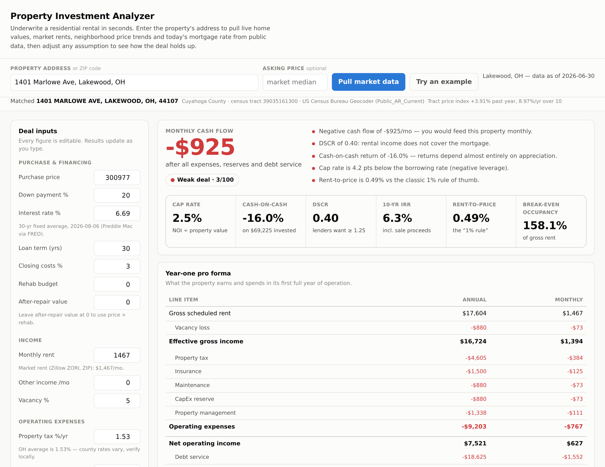
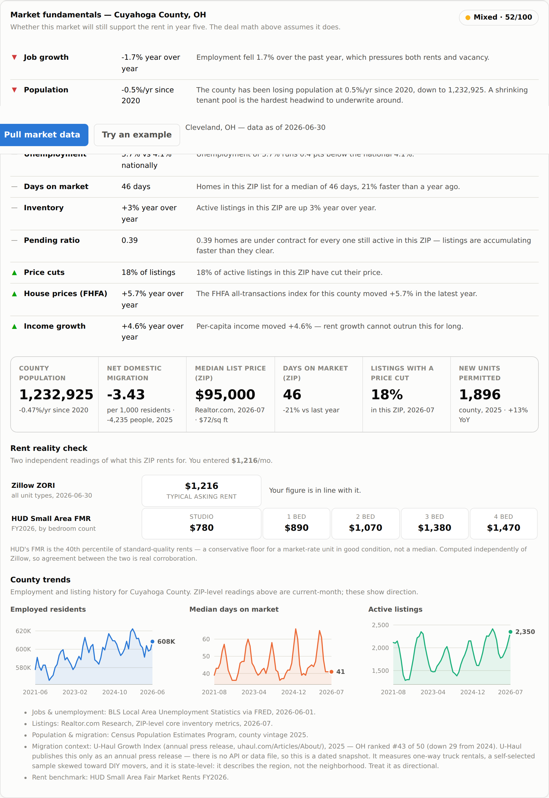

# Property Investment Analyzer

Underwrite a US residential rental property in seconds. Enter a ZIP code and the
app pulls live home values, market rents and today's mortgage rate from public
data sources, pre-fills a complete deal, and tells you whether the numbers work —
with the reasoning shown, not just a score.

Built for the investor deciding whether to pursue a specific property.



The same property's market fundamentals — where the story gets more complicated:



## Quick start

```bash
pip install -r requirements.txt
uvicorn app.main:app --reload
```

Open http://127.0.0.1:8000, type a ZIP code, and click **Pull market data**. The
first market lookup downloads Zillow's research CSVs (~130 MB) and caches them
under `data/cache/` for 24 hours; later lookups are instant.

## What it does

**Pulls the market context for you.** Typical home value and rent for the ZIP,
how both have grown over 1, 5 and 10 years, the local price-to-rent ratio, the
state's average effective property tax rate, and this week's 30-year fixed
mortgage rate. Every one of these becomes an editable input, never a hidden
constant.

**Runs a real pro forma.** A year-one operating statement from gross scheduled
rent down to cash flow, with vacancy, maintenance, CapEx reserves, management,
taxes, insurance and debt service each broken out. Reserves are included by
default because leaving them out is the most common way an amateur analysis
turns a losing property into a winning-looking one.

**Reports the metrics lenders and investors actually use.** Cap rate,
cash-on-cash return, DSCR, gross rent multiplier, rent-to-price ratio, operating
expense ratio, break-even occupancy, IRR over the hold, and equity multiple.

**Projects the hold.** Property value, loan amortization, equity, NOI and
cumulative cash flow year by year, then a sale at the end net of selling costs —
with a table view alongside the chart.

**Stress-tests the deal.** A grid of monthly cash flow across five interest rates
and five rent outcomes, so you can see how much has to go wrong before the
property stops paying for itself.

**Gives a verdict with reasons.** A 0–100 score weighing cash-on-cash return
(35%), DSCR (25%), the spread between cap rate and borrowing rate (20%) and
rent-to-price (20%) — followed by plain-language findings like "Cap rate is 1.2
pts below the borrowing rate (negative leverage)." The reasons matter more than
the score; they tell you *why*.

## Market fundamentals

Underwriting tells you whether the numbers work today. It cannot tell you
whether the market will still support the rent in year five. A second panel
answers that from county and ZIP data, scored 0–100 and explained in English:

- **Jobs** — employment growth and the unemployment rate against the national rate
- **People** — county population growth and *measured* net domestic migration
- **Listings** — days on market, inventory direction, share of listings cutting
  price, and the pending-to-active ratio, at ZIP resolution
- **Prices and incomes** — the FHFA transaction-based index and per-capita income
- **Supply** — new housing units permitted, the pipeline that competes with you
- **Rent reality check** — your rent assumption against two independent
  benchmarks: Zillow ZORI and HUD Small Area Fair Market Rents by bedroom count

The two verdicts are deliberately separate, because they disagree in useful
ways. Cleveland ZIP 44105 scores a strong deal on cash flow and only *Mixed* on
fundamentals — the rent covers the mortgage comfortably, but the county is
losing both jobs and people. That tension is the actual decision.

## Data sources

All public. **No API keys required for anything.**

| Data | Source | Via | Cadence |
|---|---|---|---|
| Mortgage rates (30/15-yr fixed) | Freddie Mac PMMS | [FRED](https://fred.stlouisfed.org/series/MORTGAGE30US) | Weekly |
| Typical home value (ZHVI) | [Zillow Research](https://www.zillow.com/research/data/) | Direct CSV | Monthly |
| Typical rent (ZORI) | Zillow Research | Direct CSV | Monthly |
| Listing metrics by ZIP | [Realtor.com Research](https://www.realtor.com/research/data/) | Direct CSV | Monthly |
| Listing metrics by county (history) | Realtor.com | FRED | Monthly |
| Employment & unemployment | BLS Local Area Unemployment Statistics | FRED | Monthly |
| House price index | FHFA all-transactions | FRED | Annual |
| Per-capita income | BEA regional accounts | FRED | Annual |
| Building permits | Census Building Permits Survey | FRED | Annual |
| Population & net domestic migration | Census Population Estimates Program | Direct CSV | Annual |
| Fair market rents by ZIP and bedroom | HUD Small Area FMRs | Direct XLSX | Annual |
| ZIP → county mapping | Census ZCTA relationship file | Direct TXT | Decennial |
| Migration direction by state | U-Haul Growth Index | Bundled snapshot | Annual |
| Property tax rates by state | Census ACS-derived | Bundled table | Static |

`GET /api/sources` returns this same inventory at runtime with each cadence, so
the freshness of an analysis is auditable rather than implied.

### How "instant" actually works

Every source above is fetched on demand and returns its newest published
vintage immediately — but an API cannot make a monthly series daily. What you
actually get today:

- **Mortgage rates** are a weekly survey (published Thursdays). Daily rate
  pricing is commercial-only.
- **Listing metrics** are the freshest signal available, roughly two weeks
  after month end.
- **Zillow values and rents** run about three weeks behind month end.
- **Employment** runs about three weeks behind.
- **Population, migration, incomes, permits and FMRs** are annual.

Cache lifetimes are matched to those cadences (12 hours for weekly series, 24
for monthly, a week for annual, 90 days for geographic crosswalks), so the app
never re-downloads a monthly file hourly to no purpose.

**A note on FRED.** Reading BLS, Census, BEA, FHFA and Realtor.com through
FRED's CSV endpoint is what keeps this app key-free. Both the BLS and Census
APIs now require free registration keys — the Census data API returns a 302 to
`missing_key.html` for every unauthenticated request, and the BLS v2 public pool
is routinely exhausted. FRED mirrors the series that matter and asks for
nothing. County series are addressed by FIPS code, so they resolve for any ZIP
in the country; rural counties are missing some series and every fetch degrades
to "unavailable" rather than failing the request.

Downloads are cached on disk. If a source is unreachable the app serves the
stale cache rather than failing; if there is no cache at all, the API returns a
clear error and the deal inputs still work by hand.

### What is *not* publicly available

Three of these are worth knowing before you trust any tool that claims them:

- **Parcel-level sold comps.** MLS-licensed, with no national public feed. The
  closest public substitutes are recorded deed transfers at the county
  recorder and the ZIP-level median list price and price-per-square-foot this
  app already shows. Anything offering true sold comps for free is either
  scraping or approximating.
- **County assessor records** (assessed value, tax history, zoning). No national
  API — every county publishes differently, though many expose ArcGIS REST
  services. This needs a per-county adapter; the app uses statewide average
  effective tax rates as a default and tells you to verify locally, because
  that is the honest position without one.
- **The U-Haul Growth Index** has no API or data file. It is an annual press
  release, so it ships here as a dated snapshot in `data/migration.json`, and
  it is a self-selected sample of one-way truck rentals at state resolution.
  Census net domestic migration is carried alongside it as a measured,
  county-level second opinion — and the two genuinely disagree: U-Haul ranks
  Texas #1 in the nation for inbound moves while Travis County (Austin) shows
  measured net domestic migration of −4.8 per 1,000. The app leads with the
  measurement and keeps U-Haul as context.

## A note on the assumptions

The suggested appreciation rate is deliberately conservative. Trailing 10-year
growth in some markets exceeds 10%/yr because of the 2020–2022 run-up, and
projecting that forward flatters every deal. The app caps the suggestion at 5%
and floors it at 0, shows you the real 1/5/10-year history next to the field, and
lets you override it.

Analysis is pre-income-tax: no depreciation, mortgage interest deduction, passive
loss treatment or depreciation recapture. Those change after-tax returns
materially and depend on your personal situation — talk to a CPA. Nothing here is
financial advice; verify taxes, insurance, rents and property condition locally
before committing capital.

## API

The web UI is a client of a documented JSON API — interactive docs at `/docs`.

| Endpoint | Purpose |
|---|---|
| `GET /api/prefill?zip=44105&price=95000` | One call: market data, suggested inputs and provenance for a ZIP. `price` is optional and scales the rent estimate. |
| `GET /api/fundamentals?zip=44105&state=OH` | Jobs, population, migration, listings, supply and rent benchmarks, plus the scored verdict |
| `GET /api/market?zip=44105` or `?metro=Austin` | Home value and rent series with growth rates |
| `GET /api/metros?q=austin` | Metro name lookup |
| `GET /api/rates` | Current and two years of weekly mortgage rates |
| `GET /api/sources` | Every source, its cadence, and what is deliberately absent |
| `POST /api/analyze` | Full analysis from a deal payload |

```bash
curl -X POST localhost:8000/api/analyze -H 'Content-Type: application/json' \
  -d '{"purchase_price": 95000, "monthly_rent": 1216, "interest_rate_pct": 6.69}'
```

## Tests

```bash
pytest              # offline: math, API contract, verdict logic
pytest -m live      # additionally hits the live public data sources
```

## Layout

```
app/analysis.py        pure investment math — payments, amortization, IRR, verdict
app/data_sources.py    public data fetchers with disk cache and graceful fallback
app/market_signals.py  county/ZIP fundamentals: jobs, people, listings, supply
app/main.py            FastAPI routes
static/index.html      single-page UI, no build step and no external dependencies
data/migration.json    dated U-Haul Growth Index snapshot (no API exists)
tests/                 66 tests, offline by default
```
